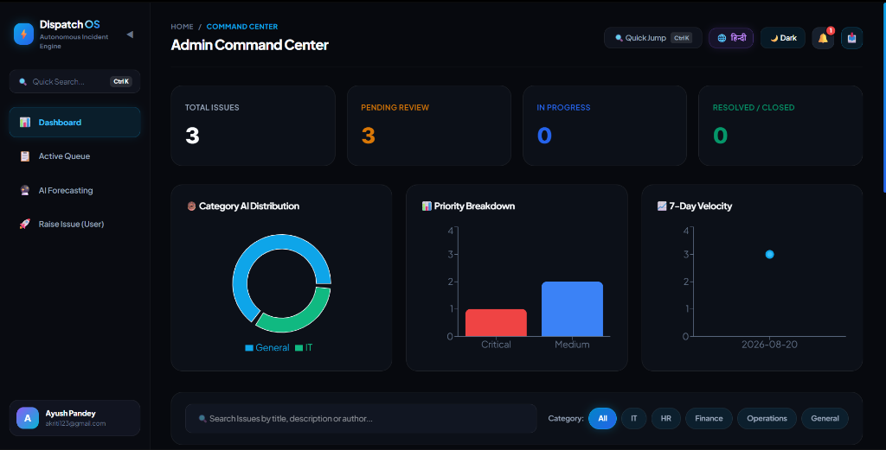
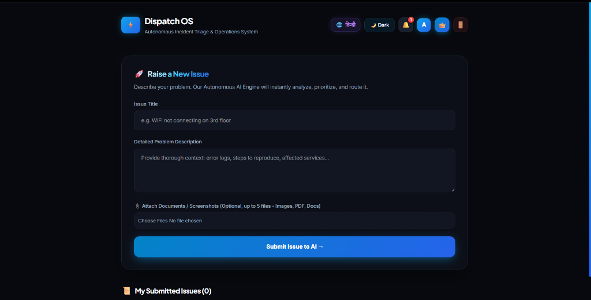
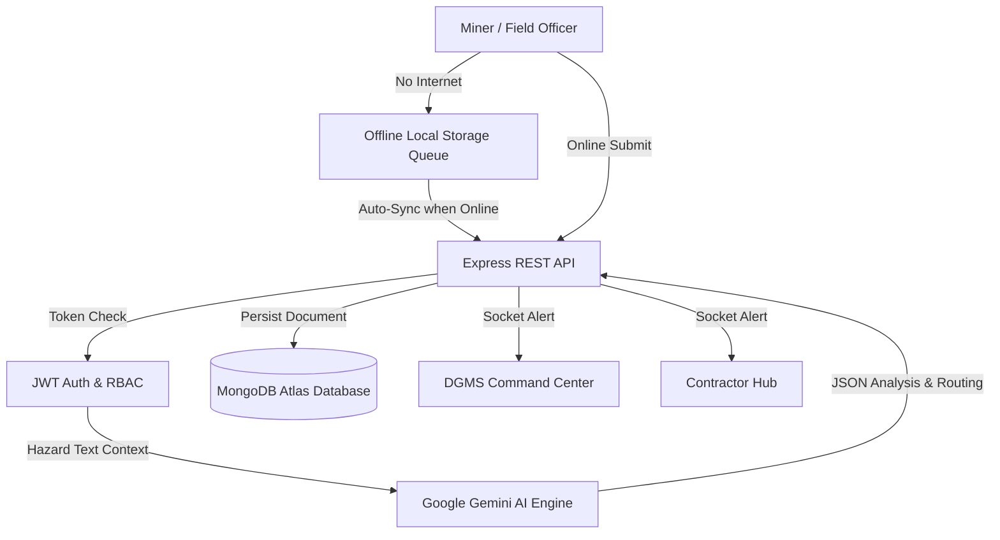

# ⚡ CoalDarpan — Smart Mining Governance & Statutory Compliance Platform

> 🌐 **Live Web Application:** [https://ai-smart-issue-routing-jbb8.vercel.app](https://ai-smart-issue-routing-jbb8.vercel.app)  

**CoalDarpan** is an enterprise-grade AI-powered smart governance and statutory compliance platform designed specifically for the Indian Coal Mining sector (DGMS & Ministry of Coal regulations). It replaces manual paper-based reporting with a robust digital ecosystem featuring **zero-network offline syncing**, **multilingual voice dictation**, **Haversine GPS geofencing**, and **autonomous hazard triage via Google Gemini AI**.

---

## 🖥️ Platform Showcase

*(Please update the `docs/screenshots/` folder with new screenshots of the CoalDarpan application)*

  
<strong>1. DGMS Central Command Center & Live Analytics Hub</strong>

  <!--  -->
  
<em>[Admin Dashboard Screenshot Placeholder]</em>

    
  
<strong>2. Field Miner Portal with Offline PWA & Voice Dictation</strong>

  <!--  -->
  
<em>[Field Portal Screenshot Placeholder]</em>

    
  
<strong>3. Contractor / Subsidiary Action Hub</strong>

  <!--  -->
  
<em>[Contractor Hub Screenshot Placeholder]</em>

---

## 🌟 Key Technical Innovations

### 🤖 1. Gemini AI Autonomous Routing & Triage
- **Natural Language Processing (NLP)**: Analyzes unstructured field reports using Google Gemini 1.5 Flash.
- **Auto-Categorization**: Automatically classifies issues into `Machinery Failure`, `Gas Leak`, `Statutory Violation`, or `General Hazard`.
- **Intelligent Routing**: Instantly routes specific violations directly to outsourced contractors, mine management, or regulatory authorities to prevent blame-shifting.

### 📶 2. Offline-First PWA (Zero Network Support)
- **Local Storage Queue**: Deep underground mines have zero cellular connectivity. Form submissions are intercepted, serialized into Base64, and saved locally via `localStorage`.
- **Auto-Sync Mechanism**: The moment a miner returns to the surface and regains network access, background event listeners trigger sequential auto-dispatch to the REST API with zero data loss.

### 🎙️ 3. Accessibility & Field Usability
- **Multilingual Voice AI**: Integrated Web Speech API allows gloved miners to dictate field notes in Hindi/English, which the AI auto-translates and structures.
- **Logbook OCR**: Converts photographs of physical paper logbooks into digital text instantly.
- **Haversine GPS Geofencing**: Verifies attendance and hazard coordinates by calculating spherical geometry distances to prevent proxy reporting.

### 📊 4. Command Center & Real-Time Dashboards
- **Live Sockets**: Real-time Socket.io integration pushes alerts to the DGMS Admin Dashboard without requiring a page refresh.
- **Hierarchical Dropdowns**: Precise geospatial mapping routing data accurately by State and CIL Subsidiary.

---

## 🏗️ System Architecture Flow

---

## 🛠️ Tech Stack

| Layer | Technology | Why |
| :--- | :--- | :--- |
| **Frontend** | React.js + Tailwind CSS | Industry standard, lightweight, responsive PWA |
| **Backend** | Node.js + Express.js | Fast & scalable non-blocking I/O processing |
| **Database** | MongoDB + Mongoose | Flexible NoSQL schema for unstructured mining reports |
| **AI Engine** | Google Gemini API | Modern LLM integration for contextual intelligence |
| **Authentication**| JWT + bcrypt | Highly secure token-based authentication |
| **Real-time** | Socket.io | Live hazard alerts & status updates |
| **Security** | Helmet.js + express-rate-limit | Production-grade security hardening |
| **Deployment** | Vercel (Frontend) + Railway/Render | Free, reliable, CI/CD automated deployment |

---

## 📡 Core API Endpoints

| Method | Endpoint | Description | Access |
| :--- | :--- | :--- | :--- |
| `POST` | `/api/auth/login` | Authenticate user (Miner, Admin, Contractor) & issue JWT | Public |
| `POST` | `/api/complaints` | Submit hazard for Gemini AI triage & routing | Protected (User) |
| `GET`  | `/api/complaints/my` | Fetch user's submitted logs | Protected (User) |
| `GET`  | `/api/complaints/all` | Fetch hierarchical logs for management | Protected (Admin) |
| `PATCH`| `/api/complaints/:id/status` | Update hazard resolution lifecycle | Protected (Admin/Contractor) |

---

*Created for Smart India Hackathon 2026 • The Bootloaders*