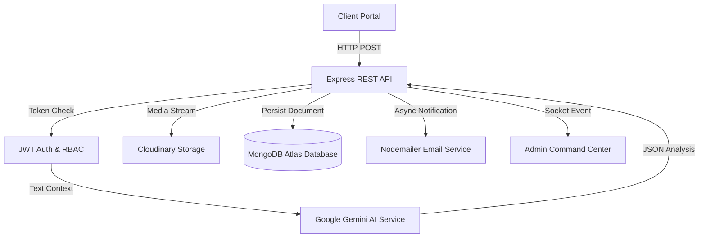

# ⚡ Dispatch OS — Autonomous Incident Triage & Resolution Platform

[](https://ai-smart-issue-routing-jbb8.vercel.app)
[](https://ai-smart-issue-routing-production.up.railway.app)
[](https://www.mongodb.com/)
[](https://opensource.org/licenses/MIT)

> 🌐 **Live Web Application:** [https://ai-smart-issue-routing-jbb8.vercel.app](https://ai-smart-issue-routing-jbb8.vercel.app)  
> ⚡ **Production Backend API:** [https://ai-smart-issue-routing-production.up.railway.app](https://ai-smart-issue-routing-production.up.railway.app)

**Dispatch OS** is an enterprise-grade autonomous incident triage and operations platform. It eliminates manual support triage by instantly analyzing incoming issues, classifying them into departments (`IT`, `HR`, `Finance`, `Operations`), calculating priority and confidence ratings (98%+), and forecasting 7-day workload surges in real-time.

---

## 🌟 Key Features

### 🤖 1. Gemini AI Autonomous Routing
- **Instant Natural Language Processing**: Analyzes incoming issues using Google Gemini 1.5 Flash.
- **Categorization**: Automatically routes to `IT`, `HR`, `Finance`, `Operations`, or `General`.
- **Urgency & Priority Scoring**: Assigns `Critical`, `High`, `Medium`, or `Low` priority badges based on contextual urgency.
- **Confidence Rating & Executive Summaries**: Generates high-level summaries and confidence scores (up to 98%+) to speed up administrative decision-making.

### 📊 2. Admin Command Center & Analytics
- **Live Recharts Dashboard**: Interactive visual breakdown using Donut Charts (Categories), Bar Charts (Priorities), and 7-Day Ingestion Velocity Line Charts.
- **Human-in-the-Loop AI Feedback Loop**: Admins can manually re-classify categories or override AI priority assignments, improving model alignment over time.
- **Lifecycle Management**: Track and update complaint lifecycles (`Pending` ➔ `In Progress` ➔ `Resolved` ➔ `Closed`).
- **Live Search & Filter Pills**: Instant real-time filtering by text search or department badges.

### 🛡️ 3. Security & Architecture
- **Stateless JWT Authentication**: Secure Access Token & Refresh Token rotation workflow.
- **Role-Based Access Control (RBAC)**: Strict separation of User and Admin permissions.
- **Security Hardening**: Protected with `Helmet`, Rate Limiting (`express-rate-limit`), CORS controls, and `express-mongo-sanitize` for NoSQL injection prevention.

### 🎨 4. Premium Modern UI/UX
- **Glassmorphic Dark Theme**: Ultra-sleek UI designed with Tailwind-inspired custom CSS tokens & smooth micro-interactions.
- **Real-time UX**: Custom sliding Toast notifications, shimmer loading skeletons, animated counter badges, and responsive desktop/mobile layouts.

---

## 🏗️ System Architecture



---

## 🛠️ Tech Stack

| Domain | Technology / Library |
| :--- | :--- |
| **Frontend** | React 18, React Router v6, Recharts, Axios, Pure Vanilla CSS |
| **Backend** | Node.js, Express.js, Socket.io |
| **Artificial Intelligence** | Google Generative AI SDK (`@google/generative-ai` - Gemini 1.5 Flash) |
| **Database & Storage** | MongoDB Atlas, Mongoose ODM, Cloudinary API |
| **Authentication** | JSON Web Tokens (`jsonwebtoken`), `bcryptjs` |
| **Security** | Helmet, Express Rate Limit, Mongo Sanitize |
| **Deployment** | Vercel (Frontend SPA), Railway (Node.js API Engine) |

---

## 📡 API Endpoints Summary

| Method | Endpoint | Description | Access |
| :--- | :--- | :--- | :--- |
| `POST` | `/api/auth/register` | Register a new user/admin | Public |
| `POST` | `/api/auth/login` | Authenticate user & receive JWT tokens | Public |
| `POST` | `/api/complaints` | Submit issue for Gemini AI analysis & routing | Protected (User) |
| `GET` | `/api/complaints/my` | Fetch user's submitted issues | Protected (User) |
| `GET` | `/api/complaints/all` | Fetch all system issues for management | Protected (Admin) |
| `PATCH` | `/api/complaints/:id/status` | Update issue lifecycle status | Protected (Admin) |
| `PATCH` | `/api/complaints/:id/category`| Human-in-the-loop AI category reclassification | Protected (Admin) |
| `GET` | `/api/analytics/dashboard` | Fetch aggregated metrics & trend stats | Protected (Admin) |

---

## ⚙️ Environment Variables

### 🌐 Frontend (`client/.env`)
Create `client/.env` file in the root of the frontend:
```env
# Local Development API URL
VITE_API_URL=http://localhost:5000/api

# Production API URL (when deployed)
# VITE_API_URL=https://ai-smart-issue-routing-production.up.railway.app/api
```

### ⚡ Backend (`server/.env`)
Create `server/.env` file in the backend directory:
```env
PORT=5000
MONGODB_URI=mongodb+srv://<username>:<password>@cluster0.mongodb.net/smart_issue_db?retryWrites=true&w=majority
JWT_SECRET=your_super_secret_access_jwt_key
JWT_REFRESH_SECRET=your_super_secret_refresh_jwt_key

# Google Gemini AI Integration
GEMINI_API_KEY=your_gemini_api_key_here

# Cloudinary Storage for Multi-File Attachments (Images, PDFs, Docs)
CLOUDINARY_CLOUD_NAME=your_cloudinary_cloud_name
CLOUDINARY_API_KEY=your_cloudinary_api_key
CLOUDINARY_API_SECRET=your_cloudinary_api_secret

# Optional: Email Service for Async Confirmation Emails
EMAIL_USER=your_email@gmail.com
EMAIL_PASS=your_gmail_app_password
```

> [!CAUTION]
> Never commit your `.env` files or expose your secret keys (`GEMINI_API_KEY`, `MONGODB_URI`, `JWT_SECRET`) to GitHub!

---

## 💻 Local Development Setup

Follow these simple steps to clone and run the project locally:

### 1. Clone the repository
```bash
git clone https://github.com/ayush-3945/ai-smart-issue-routing.git
cd ai-smart-issue-routing
```

### 2. Configure & Run Backend Server
```bash
cd server
npm install
# Configure server/.env file as shown above
npm run dev
```
*Backend will start on `http://localhost:5000`*

### 3. Configure & Run Frontend Client
```bash
# Open a new terminal
cd client
npm install
npm run dev
```
*Frontend will be live at `http://localhost:5173`*

---

## 📡 API Flow & JSON Specifications

### 🤖 1. AI Autonomous Complaint Analysis & Ingestion
Analyze, categorize, score confidence, auto-assign lead, and persist attachments with Gemini AI.

`POST /api/complaints` *(Protected - User)*

#### Headers:
`Authorization: Bearer <accessToken>`  
`Content-Type: multipart/form-data`

#### Example Request Body (FormData):
```json
{
  "title": "Production payment webhook failing with 500 internal server error",
  "description": "Payment gateway webhooks for Stripe and Razorpay are failing on our production endpoint since 11:00 AM. Customers accounts are getting debited but subscription orders remain pending.",
  "files": "[Screenshot.png, Error_Log.pdf]"
}
```

#### Example AI Response:
```json
{
  "message": "Complaint created and analyzed by AI successfully",
  "complaint": {
    "_id": "66c0e89b4f91b70e12d4a1a0",
    "title": "Production payment webhook failing with 500 internal server error",
    "description": "Payment gateway webhooks for Stripe and Razorpay are failing...",
    "category": "IT",
    "priority": "Critical",
    "assignedTo": "Vikram Sharma",
    "assignedLeadRole": "IT Support Lead",
    "aiConfidence": 98,
    "aiSummary": "Critical failure in payment webhook endpoints for Stripe/Razorpay resulting in delayed subscription fulfillment.",
    "suggestedResolution": "Inspect payment server API logs, check webhook signing secrets, and review retry queues.",
    "troubleshootingSteps": [
      "Step 1: Check server logs for HTTP 500 webhook rejection exceptions",
      "Step 2: Verify Razorpay and Stripe webhook signing secrets and SSL certificates",
      "Step 3: Replay failed webhook events from payment gateway dashboard after patching"
    ],
    "attachments": [
      {
        "url": "https://res.cloudinary.com/demo/image/upload/v1/complaints/Screenshot.png",
        "fileType": "image",
        "fileName": "Screenshot.png"
      }
    ],
    "status": "Pending",
    "comments": [],
    "createdAt": "2026-08-18T10:30:00.000Z"
  }
}
```

---

### 🔄 2. Live AI Duplicate Issue Detection
Real-time as-you-type check to prevent redundant spam tickets.

`POST /api/complaints/check-duplicate` *(Protected)*

#### Example Request:
```json
{
  "title": "Cafeteria coffee machine broken"
}
```

#### Example Response:
```json
{
  "hasDuplicates": true,
  "duplicates": [
    {
      "_id": "66c0d48a1e24c30b88e1a2f1",
      "title": "Cafeteria coffee machine malfunctioning on 2nd floor pantry",
      "category": "Operations",
      "priority": "Medium",
      "status": "In Progress",
      "aiSummary": "Espresso machine dispensing only hot water with error E-04."
    }
  ]
}
```

---

### 💬 3. Real-Time Two-Way Discussion Thread
Live Socket.io message broadcast between User and Support Admin.

`POST /api/complaints/:id/comments` *(Protected)*

#### Example Request:
```json
{
  "message": "Vendor technician has been scheduled for today at 2:00 PM."
}
```

#### Example Response:
```json
{
  "message": "Comment added successfully",
  "comment": {
    "sender": "66c0d12a9e84b70e12d4a001",
    "senderName": "Ayush Pandey",
    "senderRole": "admin",
    "message": "Vendor technician has been scheduled for today at 2:00 PM.",
    "createdAt": "2026-08-18T10:35:00.000Z"
  }
}
```

---

## 📜 License

Distributed under the **MIT License**. See `LICENSE` for more information.

<p align="center">
  Designed & Built with ❤️ by <strong>Ayush Pandey</strong>
</p>