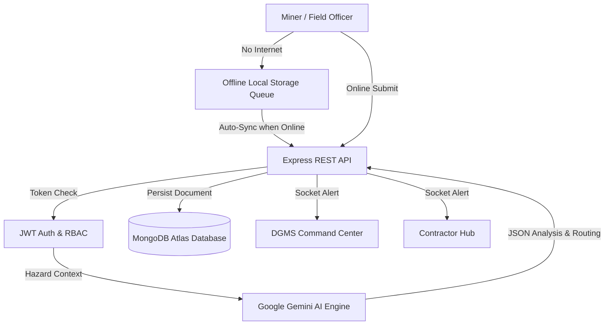

# ⛏️ CoalDarpan

**AI-Powered Smart Mining Governance & Statutory Compliance PWA**

[](https://coaldarpan.vercel.app)
[](https://coaldarpan-api.up.railway.app)
[](https://www.mongodb.com/)


---

## 📖 Overview

**CoalDarpan** is an enterprise-grade statutory compliance platform designed specifically for the Indian Coal Mining sector (DGMS & Ministry of Coal regulations). It replaces manual paper-based reporting with a robust digital ecosystem. 

Designed for extreme field conditions, it features **zero-network offline syncing**, **multilingual voice dictation**, **Haversine GPS geofencing**, and **autonomous hazard triage via Google Gemini AI**.

---

## ✨ Key Features

- **🤖 Autonomous AI Triage**: Utilizes Google Gemini 1.5 Flash to analyze unstructured field reports and automatically classify hazards (e.g., Gas Leak, Machinery Failure).
- **📶 Offline-First PWA**: Built for deep underground mines. Forms are saved locally via `localStorage` and auto-sync the moment network access is restored.
- **⚡ Real-Time Telemetry**: Socket.io integration pushes live alerts to the DGMS Command Center without page refreshes.
- **🎙️ Voice Dictation**: Integrated Web Speech API allows gloved miners to dictate notes in Hindi/English.
- **📍 GPS Geofencing**: Verifies attendance and hazard coordinates using spherical geometry to prevent proxy reporting.

---

## 🚀 Tech Stack


**React.js | Node.js | Express | MongoDB Atlas | Socket.io | Google Gemini API**

---

## 🏗️ Architecture Flow



---

## ⚙️ Installation & Setup

Follow these steps to run CoalDarpan locally on your machine.

### Prerequisites
- Node.js (v18+)
- MongoDB URI
- Google Gemini API Key

### 1. Clone the repository
```bash
git clone https://github.com/ayush-3945/ai-smart-issue-routing.git
cd ai-smart-issue-routing
```

### 2. Setup Backend
```bash
cd server
npm install
```
Create a `.env` file in the `server` directory:
```env
PORT=5000
MONGODB_URI=your_mongodb_connection_string
JWT_SECRET=your_jwt_secret_key
GEMINI_API_KEY=your_google_gemini_api_key
```
Start the backend server:
```bash
npm run dev
```

### 3. Setup Frontend
```bash
cd ../client
npm install
```
Create a `.env` file in the `client` directory:
```env
VITE_API_BASE_URL=http://localhost:5000/api
```
Start the frontend development server:
```bash
npm run dev
```

---

## 📡 Core API Endpoints

| Method | Endpoint | Description | Access |
| :--- | :--- | :--- | :--- |
| `POST` | `/api/auth/login` | Authenticate user & issue JWT | Public |
| `POST` | `/api/complaints` | Submit hazard for Gemini AI triage & routing | Protected (User) |
| `GET`  | `/api/complaints/my` | Fetch user's submitted logs | Protected (User) |
| `GET`  | `/api/complaints/all` | Fetch hierarchical logs for management | Protected (Admin) |
| `PATCH`| `/api/complaints/:id/status` | Update hazard resolution lifecycle | Protected (Admin/Contractor) |

---

**Built for Smart India Hackathon 2026 by The Bootloaders 🚀**